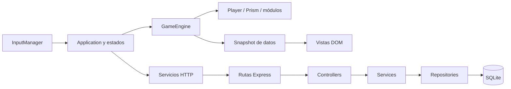
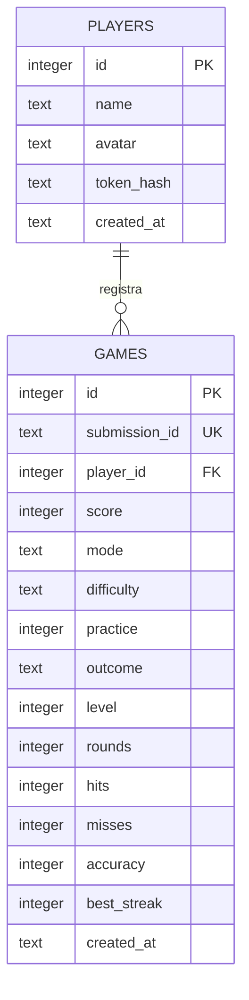
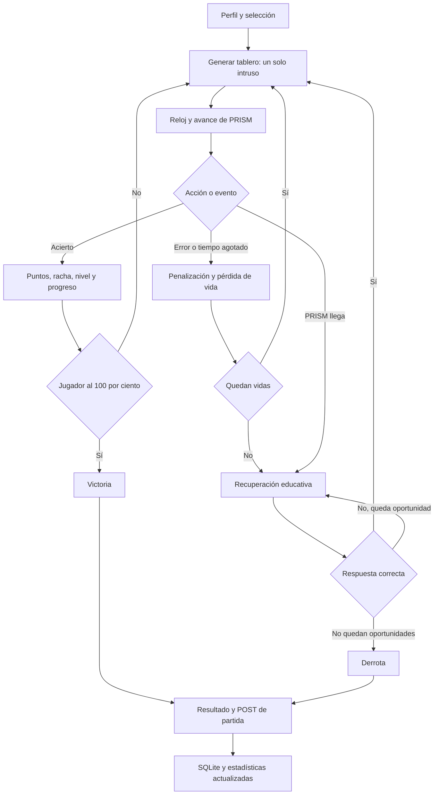

# ¿DÓNDE ESTÁ? × NEONSTRIDE · Documento técnico

**Autores:** Diego Heredia y Jenmarie Polanco · **Asignatura:** Desarrollo e implementación de soluciones web y multimedia

**Docente:** Carlos Escalante · **Institución:** Politécnico San Valero

Fuente editable del documento técnico. La versión maquetada está en `technical-document.pdf`: cuatro páginas A4 renderizadas y revisadas visualmente. Los diagramas Mermaid se conservan aquí para futuras ediciones. Los datos de integrantes, asignatura, docente e institución están incorporados.

## Página 1 · Descripción, objetivos y tecnologías

### 1. Descripción del proyecto

¿DÓNDE ESTÁ? × NEONSTRIDE es un videojuego educativo de percepción visual. En cada ronda, el jugador observa una cuadrícula con símbolos iguales salvo uno y selecciona el elemento diferente. La carrera contra PRISM añade presión temporal. Una respuesta correcta aumenta la puntuación y el progreso; los errores consumen vidas. Preguntas educativas permiten recuperar una situación de derrota.

La aplicación conserva los rasgos de la versión inicial: colores neón, paneles oscuros, avatares de emojis, pistas, cuatro dificultades y personalización. La refactorización soluciona el acoplamiento entre juego y navegador y sustituye la clasificación local por persistencia real. La práctica permite aprender sin presión y no se mezcla con la competición.

### 2. Objetivos

El objetivo general es implementar un videojuego completo con frontend modular y backend por capas que dos estudiantes puedan explicar. Los objetivos específicos son separar las reglas del DOM, centralizar constantes, registrar jugadores y partidas mediante REST, proteger las consultas con parámetros, validar entradas y demostrar el comportamiento mediante pruebas repetibles.

La calidad se comprueba con tres límites estructurales: archivos de código de hasta 300 líneas, funciones de hasta 40 líneas y bloques con profundidad máxima de tres. Estos límites se acompañan de responsabilidades claras; dividir código sin separar responsabilidades no sería suficiente.

### 3. Tecnologías utilizadas

| Tecnología                    | Responsabilidad                                            |
| ----------------------------- | ---------------------------------------------------------- |
| HTML5 y CSS3                  | Estructura semántica, modales, diseño adaptable y temas.   |
| JavaScript ES6                | Módulos de dominio, entrada, vistas y servicios HTTP.      |
| Node.js y Express             | Servidor HTTP, enrutamiento y middleware.                  |
| SQLite                        | Jugadores, partidas, restricciones e índices persistentes. |
| Web Audio                     | Efectos sonoros sin archivos externos.                     |
| ESLint, Prettier y Acorn      | Estilo, límites y análisis estructural.                    |
| Node Test, JSDOM y Playwright | Pruebas de dominio, API, integración y navegador.          |

SQLite evita requerir un servidor adicional para la demostración. La interfaz usa fuentes del sistema y no necesita servicios externos. Para producción, el archivo de base de datos debe guardarse en un disco persistente.

**[SALTO DE PÁGINA]**

## Página 2 · Arquitectura y organización

### 4. Arquitectura



El motor no conoce `document`, eventos HTML ni peticiones. Recibe `tick(seconds)`, `select(index)`, `hint()` y las respuestas educativas. Devuelve un estado que las vistas convierten en texto, clases y barras. El bucle usa tiempo real transcurrido; la pausa impide consumir el reloj de la ronda, la pregunta o la transición.

El backend convierte HTTP en operaciones del dominio. Las rutas solo asocian URL y controller. Los controllers extraen parámetros y producen el sobre JSON. Los services aplican validación, autorización y reglas. Los repositories ejecutan SQL parametrizado. `server.js` abre los recursos y escucha el puerto; `app.js` compone las dependencias y permite probarlas con una base aislada.

### 5. Diagrama de carpetas

```text
neonstride/
├── frontend/
│   ├── index.html
│   └── src/
│       ├── css/ (5 responsabilidades)
│       ├── assets/ (images, sounds, fonts)
│       └── js/
│           ├── main.js
│           ├── core/       entities/   states/
│           ├── input/      modules/    services/
│           └── utils/      data/       ui/
├── backend/
│   ├── server.js
│   └── src/
│       ├── config/        routes/       controllers/
│       ├── services/      repositories/ models/
│       └── middlewares/   utils/
├── tests/   scripts/   docs/
└── README.md, CHECKLIST.md y configuración
```

`ui` contiene renderizado y coordinación del navegador. `states` define la presentación de menú, selección, partida, pausa, resultados, récords, logros, configuración y ayuda. `modules` contiene reglas reutilizables. `data` conserva preguntas y pares de símbolos. Los archivos de pruebas no se distribuyen con el frontend publicado.

**[SALTO DE PÁGINA]**

## Página 3 · Datos, entidades y API REST

### 6. Diagrama de base de datos



### 7. Descripción de entidades

`players` almacena el piloto y un hash del token generado al registrarse. El token permite modificar únicamente ese perfil y enviar sus partidas; no se devuelve en listados. `games` registra estadísticas completas y una clave de envío única, para que reintentar no duplique datos. Las fechas se generan en SQLite.

En memoria, `Player` mantiene puntuación, vidas, pistas, aciertos, errores, racha, nivel y progreso. `Prism` calcula su velocidad a partir de dificultad, nivel y progreso del jugador. `Quiz` reúne pregunta, respuesta seleccionada y reloj. Los catorce logros se derivan del historial competitivo, sin tabla redundante. Los récords por modo y dificultad también se calculan a partir de la base.

### 8. API REST

`GET/POST /api/players` consulta y registra pilotos; `PUT /api/players/:id` modifica el perfil autorizado. `GET/POST /api/games` consulta o registra partidas. `GET /api/players/:id/games` devuelve el historial reciente; `/statistics` devuelve récords y logros. `GET /api/leaderboard` acepta filtros de modo y dificultad y devuelve cinco pilotos únicos.

Cada respuesta contiene `success`, `data` y `message`. Se distinguen solicitudes inválidas, falta de autorización, recurso inexistente y error interno; las excepciones no se envían sin procesar. CORS utiliza una lista explícita de orígenes. La validación manual revisa tipos, enums, límites y coherencia; la precisión se recalcula en servidor. Los parámetros SQL impiden interpretar un nombre o un filtro como parte de la consulta.

**[SALTO DE PÁGINA]**

## Página 4 · Flujo, verificación y conclusión

### 9. Flujo principal del videojuego



Cada ronda elige un par aleatorio y una posición distinta. Los bonus premian rapidez y racha; los errores y pistas descuentan puntos sin permitir números negativos. Cada tres aciertos aumenta el nivel. PRISM acelera con una curva cuadrática por nivel, mientras el retroceso provocado por cada acierto disminuye. La dificultad elegida amplifica ambos efectos y la reducción de tiempo; la recuperación mantiene esta presión. La cuadrícula tiene un máximo de ocho columnas, y el tiempo mínimo evita rondas imposibles por reducción ilimitada.

La recuperación dispone de dos oportunidades por partida. Una respuesta correcta deja al menos una vida y reduce PRISM al 35 %. Una incorrecta consume la oportunidad; si queda otra, aparece una nueva pregunta. La práctica elimina reloj y presión, mantiene vidas y pistas y se excluye de estadísticas competitivas en el propio backend.

### 10. Verificación y conclusión

Se prepararon pruebas del motor sin navegador, pruebas HTTP con SQLite y pruebas de interfaz con DOM simulado conectado a una API real. Cubren acierto, error, reloj, pausa, pistas, victoria, recuperación, práctica, validación, CORS, persistencia, idempotencia y reintento. La auditoría AST mide líneas de archivos y funciones; ESLint revisa profundidad y convenciones. El detalle de resultados se entrega en `final-audit.md`.

La revisión visual con Chrome sigue pendiente por restricciones de procesos del entorno de entrega. La interfaz tiene reglas responsivas, pero el DOM simulado no permite certificar su composición en móviles reales. El script de navegador y los marcadores de capturas quedan preparados para esa revisión.

La solución cumple la separación académica entre lógica, entrada, presentación y persistencia y evita introducir frameworks innecesarios. Para publicación es obligatorio montar SQLite en almacenamiento persistente. Para una competición de alto riesgo haría falta validar las partidas en servidor, más allá de la coherencia actual. La entrega académica requiere todavía nombres, trabajo y commits reales, revisión visual, video y defensa individual.
